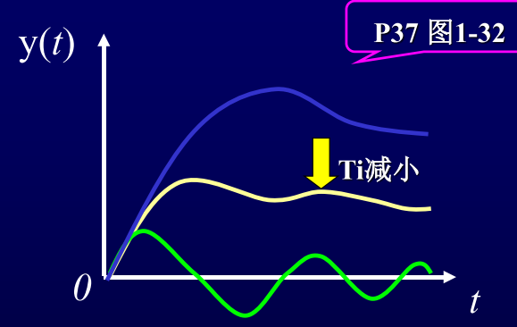

# 1.6 控制器参数对系统控制质量的影响及控制规律的选择

## 1.6.1控制器参数对系统静态误差的影响

* 当控制器为纯比例作用时，系统余差与放大倍数成反比，即与比例度成正比，比例度δ越大， 余差越大.
* 当控制器引入积分作用时，可消除余差
* 微分作用对余差没有影响

## 1.6.2控制器参数对系统动态误差的影响

### ①比例放大倍数$$K_c$$

$$K_c$$由小向大变化,系统将由稳定向振荡发展,稳定性变差,但余差会减小.

### ②积分时间$$T_i$$

比例作用基础上叠加对偏差的积分输出 —消除余差.

Ti小，积分作用强，消除余差的能力强，但是，系统振 荡加剧，衰减比变小

Ti大，积分作用弱，消除余差的能力弱。

### ③微分时间$$T_d$$

微分输出与偏差变化速度成正比， —— “超前”调节作用$$T_d$$大，微分作用大，控制系统灵敏， 但稳定性变差

## 1.6.3控制规律的选择

1. 对控制要求不高的参数，可只采用比例控制器
2. 对控制要求不高，且惯性较大的参数，可采用比例-微分控制器
3. 对于精度要求高的，要加入积分规律，PI
4. 较重要，控制精度要求比较高，希望动态偏差小，被控对象的时间滞后比较大的，PID

