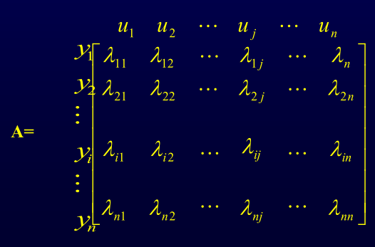

# 1.7系统关联及其消除方法

## 1.7.1系统关联及其影响

所谓关联，就是系统之间彼此相互有影响

## 1.7.2分析系统关联的方法

### 相对增益定义

$$\lambda_{i j}=\frac{\frac{\partial y_{i}}{\partial u_{j}} | u_{r}}{\frac{\partial y_{i}}{\partial u_{j}} | y_{r}}$$

1. $$\lambda_{ij}=1$$其它回路闭合与否对本通道没有影响，即， 该通道的控制回路与其它回路没有关联

2. $$\lambda_{ij}>1$$其它回路闭合对本通道有影响，即， 该通道的控制回路与其它系统有关联，这种关联使得本回路增益变小，
   负关联。（$$λ_{ij}$$越大关联越大）

3. $$\lambda_{ij}<1$$其它回路闭合对本通道有影响，即， 该通道的控制回路与其它系统有关联，这种关联使得本回路增益变大， 正关联。（$$λ_{ij}$$越小关联越大）

4. $$\lambda_{ij}=0$$其它回路开环时，ui对yi没有影响，j – i 通道的控制回路 不能构成

5. $$\lambda_{ij}<0$$符号相反，其它回路闭合时，本回路将变成不稳定 （条件稳定回路）

6. $$\lambda_{ij}=\infty$$只有在其它回路开环时，才能用ui控制yi，即此通道 的控制回路才能成立

### 相对增益矩阵A – 布里斯托尔阵列

   

* 每行（列）相对增益之和为1

* 已知各通道的开环增益$$K,\lambda=K\cdot [K^{-1}]^T$$

  例:设过程输入输出关系如下，试选择控制回路
  $$
  \begin{array}{l}
  Y_{1}(s)=\frac{1}{s+1} U_{1}(s)+\frac{1}{0.1 s+1} U_{2}(s) \\
  Y_{2}(s)=\frac{-0.2}{0.5 s+1} U_{1}(s)+\frac{0.8}{s+1} U_{2}(s)
  \end{array}
  $$
  解： 计算相对增益
  $$
  K=\left[\begin{array}{cc}
  1 & 1 \\
  -0.2 & 0.8
  \end{array}\right]
  $$

  $$
  \left[K^{-1}\right]^{r}=\left(\left[\begin{array}{cc}
  1 & 1 \\
  -0.2 & 0.8
  \end{array}\right]^{-1}\right)^{T}=\left[\begin{array}{cc}
  0.8 & -1 \\
  0.2 & 1
  \end{array}\right]^{T}=\left[\begin{array}{cc}
  0.8 & 0.2 \\
  -1 & 1
  \end{array}\right]
  \\
  \lambda=K\left[K^{-1}\right]^{T}=\left[\begin{array}{cc}
  1 & 1 \\
  -0.2 & 0.8
  \end{array}\right] *\left[\begin{array}{cc}
  0.8 & 0.2 \\
  -1 & 1
  \end{array}\right]=\left[\begin{array}{cc}
  0.8 & 0.2 \\
  0.2 & 0.8
  \end{array}\right]
  $$

  

## 1.7.3削弱或消除系统间关联的方法

1. 按照变量配对，若λ均在1的附近，说明关联不大，此时，可 采用控制系统参数整定的方法，即拉开工作频率范围，可以削弱关 联的影响
2. 若相对增益都离1较远，说明彼此关联较厉害，必须从控制系统设计入手解决，如采用解耦控制方案
3. 相对增益有些离1远，有些在1附近，可采用重新变量配对，再进行处理

